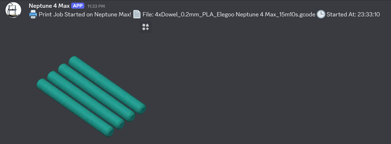
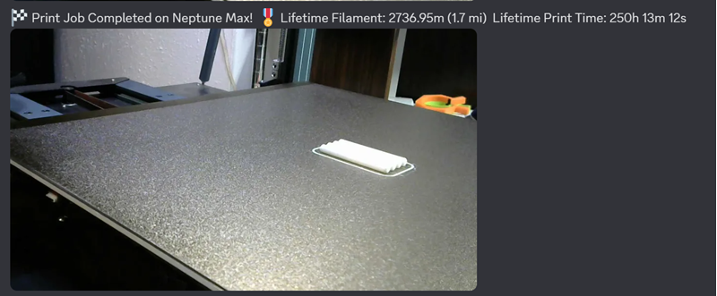

# 🔨 HAMMER – Home Assistant Moonraker Messaging & Event Relay

> 🔖 Version: **v1.3.7.5**

This project was born out of a simple frustration: I missed being able to watch and share my 3D printer's progress with friends and family in our Discord hobby channel. OctoPrint handled this beautifully, but it doesn’t work with Klipper-based printers. So I built this—starting with Discord alerts, and then expanding into mobile, Alexa, persistent notifications, and more. What began as a fix for one missing feature became a full-featured alert system for any Klipper printer running Moonraker.

Get 3D printer alerts that actually matter! This Home Assistant automation keeps you in the loop with audio, visual, and customizable notifications—so you always know when your print is rolling, pausing, or wrapping up.

---

## 💥 Core Features

- 📢 **Discord Notifications**
- 🗣️ **Alexa Voice Alerts**
- 📱 **Mobile Notifications**
- 🖥️ **Persistent Home Assistant Notifications**
- 📷 **Snapshot & Thumbnail Support**
- 😹 **Toggle-Based Controls**
- ⏰ **Time-Restricted Alexa Announcements**
- 🎯 **Custom Progress Intervals**
- 🧵 **Filament Used (Per Job + Lifetime)**
- 🧹 **Collapsible UI**

---

## 📸 Example Alerts

### Print Started (Discord)


### Print Finished (Discord)


---

## 🧠 TL;DR – Read This Before Filing Issues

- Fully modular — supports multiple printers with unique sensors
- Uses Moonraker integration sensors, not direct polling
- Short prints (<30 mins) may miss progress updates
- Uses fuzzy math to detect progress deltas
- Not a bug. Just how sensor polling works.

---

## 🛠️ Prerequisites

**⚠️ Entity Naming Required – READ THIS**

Before you do anything else, rename your printer's device in Home Assistant:

1. Go to **Settings → Devices & Services → Integrations**
2. Find the **Moonraker** integration
3. Each printer shows up as a device (usually called *1 Device* by default)
4. Click on the device name, then click the ✏️ **pencil icon** in the top-right
5. Enter a unique name (like `Neptune Max`, `Voron`, etc.)
6. Click **Update**
7. When prompted, allow Home Assistant to rename all related entities

This ensures all related sensors, cameras, and helpers follow a consistent naming pattern for the blueprint to recognize.

All Moonraker sensor and camera entities must follow a consistent naming pattern using a unique base name (example: `neptune_max`). This blueprint uses that base to dynamically build the required entity IDs like:

```
sensor.neptune_max_current_print_state
sensor.neptune_max_progress
camera.neptune_max_thumbnail
```

If your sensors are not named this way, rename them in Home Assistant to follow this format before using the blueprint. This is required even if you only have **one** printer.

- Home Assistant
- [HACS](https://hacs.xyz/docs/setup/download)
- [Alexa Media Player](https://github.com/custom-components/alexa_media_player/wiki/Configuration)
- [Moonraker Integration](https://github.com/marcolivierarsenault/moonraker-home-assistant)

---

### 🛠️ Discord Notification Setup (Optional)

Want notifications in Discord? You gotta set up a webhook and a shell command:

#### Step 1: Create a Discord Webhook
1. Open Discord and go to **Server Settings → Integrations**.
2. Click **New Webhook**.
3. Choose a channel and click **Copy Webhook URL**.
4. **DO NOT share this URL with anyone.** It gives full access to post messages in your server.

#### Step 2: Add the Shell Command to Home Assistant

In your `shell_commands.yaml`:

```yaml
printer_notify_webhook: >
  curl -X POST -F "payload_json={"content": "{{ message }}"}" -F "file=@/config/www/{{ snapshot_filename }}" https://discord.com/api/webhooks/your_webhook_here
```

Replace the URL with your real webhook.
Do **not** quote the full URL.

Then add or make sure this exists in `configuration.yaml`:

```yaml
shell_command: !include shell_commands.yaml
```

---

### 🛠️ Installing HAMMER Blueprint

HACS no longer supports adding custom repositories for blueprints directly.  
To install HAMMER, use the built-in manual import option in Home Assistant:

1. Go to **Settings → Automations & Scenes → Blueprints**
2. Click the **Import Blueprint** button in the bottom right
3. Paste this URL:
   ```
   https://raw.githubusercontent.com/smcneece/HAMMER/main/blueprints/automation/smcneece/hammer.yaml
   ```
4. Click **Preview → Import** to complete the setup

---

### 🔔 Staying Updated

HACS will not automatically notify you of new blueprint updates using this install method.

To get update notifications:
- Click the **“Watch”** button (top-right of the GitHub repo)
- Select **"Releases only"** or **"All Activity"**
- Or check the [Releases](https://github.com/smcneece/HAMMER/releases) page manually

---

### 🔍 Finding Your Mobile & Alexa Notify Entities

> ⚠️ Developer Tools → Services no longer shows notify services as of recent Home Assistant updates. Here's the new reliable method:

The `notify.` domain is funky and doesn’t always show up in the **Entities** list. Here’s the best way to find the right names:

#### 📱 Mobile App Notify Entity
1. Go to **Settings → Automations & Scenes → Create Automation**
2. Choose **Create New Automation**
3. Scroll to the **Then Do** section and click **Add Action**
4. Choose **Call Service**, then start typing `notify.mobile_app_`
5. You should see something like:
   ```
   notify.mobile_app_shawn_cell
   ```
4. That’s your mobile notification target.

#### 🗣️ Alexa Notify Entity
1. Make sure **Alexa Media Player** is installed and set up.
2. Go to **Settings → Automations & Scenes → Create Automation**
3. Scroll to **Then Do**, choose **Call Service**, and search for: `notify.alexa_media_`
4. Look for one like:
   ```
   notify.alexa_media_living_room_echo
   notify.alexa_media_3d_printer_notification_group
   ```
4. Use the group name if you want multiple Echos to yell at you at once.

> 🧠 You can also create Alexa **announcement groups** in the Alexa app for easier control.

---

## 📥 Blueprint Inputs Overview

**Main Inputs You Should Actually Care About**

- `sensor_base`: This is the base name for all your printer sensors. Example: `neptune_max` → builds `sensor.neptune_max_progress`, `camera.neptune_max_thumbnail`, etc.
- `main_sensor`: Your printer's print state sensor. Usually ends in `_current_print_state`
- `notify.mobile_app_*`: Your mobile phone's notify target
- `notify.alexa_media_*`: Alexa group or device for TTS alerts
- `disable_progress_notifications`: Turns off mobile + persistent alerts for print percentage spam
- `progress_interval`: Set this to how often you want updates (1%, 5%, 10%, etc.)
- `include_images_in_discord`: Toggles snapshot uploads to Discord
- `enable_alexa_notifications`: Toggle Alexa support entirely

If you don't touch anything else, you'll still be fine. But hey, more toys = more fun.

---

## 💡 Coming Soon / Ideas for v1.4+
- More completion stats
- Filament-out detection
- Text-only alert fallback
- Custom Scripts for triggers
- Toggle webcam/thumbnail
- HACS store submission

---

## 🏷️ GitHub Repo Tags
```
home-assistant, blueprint, 3d-printing, moonraker, klipper, discord, alexa, notifications, hacs
```
