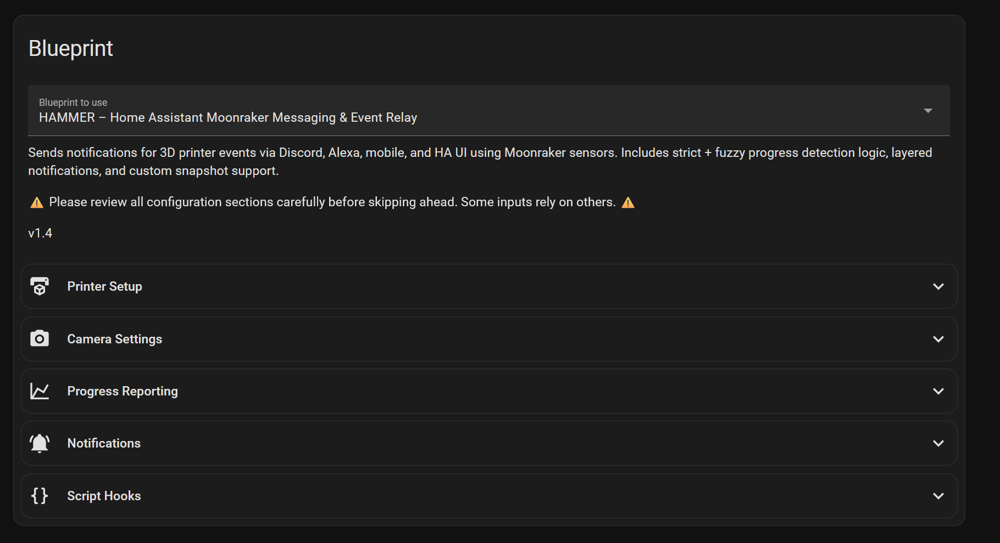

🔨 HAMMER – Home Assistant Moonraker Messaging & Event Relay

 🔖 Version: v1.4.0
 
This project was born out of a simple frustration: I missed being able to watch and share my 3D printer's progress with friends and family in our Discord hobby channel. OctoPrint handled this beautifully, but it doesn’t work with Klipper-based printers. 
So I built this—starting with Discord alerts, and then expanding into mobile, Alexa, persistent notifications, and more. What began as a fix for one missing feature became a full-featured alert system for any Klipper printer running Moonraker.

Get 3D printer alerts that actually matter! This Home Assistant automation keeps you in the loop with audio, visual, and customizable notifications—so you always know when your print is rolling, pausing, or wrapping up.

💥 Core Features

    📢 Discord Notifications
    🗣️ Alexa Voice Alerts
    📱 Mobile Notifications
    🖥️ Persistent Home Assistant Notifications
    📷 Snapshot & Thumbnail Support
    😹 Toggle-Based Controls
    ⏰ Time-Restricted Alexa Announcements
    🎯 Custom Progress Intervals
    🧵 Filament Used (Per Job + Lifetime)
    🧹 Collapsible UI
    🔧 Optional Script Execution for Events (start, finish, error, filament-out)

#### Collapsible UI:

📸 Example Alerts

**Print Started (Discord)**  

**Print Finished (Discord)**  

🧠 TL;DR – Read This Before Filing Issues

    Fully modular — supports multiple printers with unique sensors
    Uses Moonraker integration sensors, not direct polling
    Short prints (<30 mins) may miss progress updates
    Uses fuzzy math to detect progress deltas
    Not a bug. Just how sensor polling works.
    Blueprint now supports script execution per event using !input syntax (finally fixed!)

🛠️ Prerequisites

⚠️ Entity Naming Required – READ THIS

Before you do anything else, rename your printer's device in Home Assistant:

    Go to Settings → Devices & Services → Integrations
    Find the Moonraker integration
    Each printer shows up as a device (usually called 1 Device by default)
    Click on the device name, then click the ✏️ pencil icon in the top-right
    Enter a unique name (like Neptune Max, Voron, etc.)
    Click Update
    When prompted, allow Home Assistant to rename all related entities

This ensures all related sensors, cameras, and helpers follow a consistent naming pattern for the blueprint to recognize.

All Moonraker sensor and camera entities must follow a consistent naming pattern using a unique base name (example: neptune_max). This blueprint uses that base to dynamically build the required entity IDs like:

sensor.neptune_max_current_print_state
sensor.neptune_max_progress
camera.neptune_max_thumbnail

If your sensors are not named this way, rename them in Home Assistant to follow this format before using the blueprint. This is required even if you only have one printer.

    Home Assistant
    HACS
    Alexa Media Player
    Moonraker Integration

🛠️ Discord Notification Setup (Optional)

Want notifications in Discord? You gotta set up a webhook and a shell command:

Step 1: Create a Discord Webhook

    Open Discord and go to Server Settings → Integrations.
    Click New Webhook.
    Choose a channel and click Copy Webhook URL.
    DO NOT share this URL with anyone. It gives full access to post messages in your server.

Step 2: Add the Shell Command to Home Assistant

In your shell_commands.yaml:

printer_notify_webhook: >
  curl -X POST -F "payload_json={\"content\": \"{{ message }}\"}" -F "file=@/config/www/{{ snapshot_filename }}" https://discord.com/api/webhooks/your_webhook_here

Replace the URL with your real webhook. Do not quote the full URL.

Then add or make sure this exists in configuration.yaml:

shell_command: !include shell_commands.yaml

🔔 Staying Updated

HACS will not automatically notify you of new blueprint updates using this install method.

To get update notifications:

    Click the “Watch” button (top-right of the GitHub repo)
    Select "Releases only" or "All Activity"
    Or check the Releases page manually

🔍 Finding Your Mobile & Alexa Notify Entities

⚠️ Developer Tools → Services no longer shows notify services as of recent Home Assistant updates. Here's the new reliable method:

📱 Mobile App Notify Entity

    Go to Settings → Automations & Scenes → Create Automation
    Choose Create New Automation
    Scroll to the Then Do section and click Add Action
    Choose Call Service, then start typing notify.mobile_app_
    You should see something like:

    notify.mobile_app_shawn_cell

    That’s your mobile notification target.

🗣️ Alexa Notify Entity

    Make sure Alexa Media Player is installed and set up.
    Go to Settings → Automations & Scenes → Create Automation
    Scroll to Then Do, choose Call Service, and search for: notify.alexa_media_
    Look for one like:

    notify.alexa_media_living_room_echo
    notify.alexa_media_3d_printer_notification_group

    Use the group name if you want multiple Echos to yell at you at once.

    🧠 You can also create Alexa announcement groups in the Alexa app for easier control.

📥 Blueprint Inputs Overview

Main Inputs You Should Actually Care About

    sensor_base: This is the base name for all your printer sensors. Example: neptune_max → builds sensor.neptune_max_progress, camera.neptune_max_thumbnail, etc.
    main_sensor: Your printer's print state sensor. Usually ends in _current_print_state
    notify.mobile_app_*: Your mobile phone's notify target
    notify.alexa_media_*: Alexa group or device for TTS alerts
    disable_progress_notifications: Turns off mobile + persistent alerts for print percentage spam
    progress_interval: Set this to how often you want updates (1%, 5%, 10%, etc.)
    include_images_in_discord: Toggles snapshot uploads to Discord
    enable_alexa_notifications: Toggle Alexa support entirely

If you don't touch anything else, you'll still be fine. But hey, more toys = more fun.

🧰 Script Execution (Optional)

You can now run Home Assistant scripts automatically when certain printer events occur:

- On Print Start
- On Print Finish
- On Filament Out
- On Error

These are fully optional and available via dropdown selectors in the blueprint UI.
Scripts can trigger relays, lights, TTS, or anything else you configure.

⚠️ Scripts must already exist in Home Assistant. Use the dropdowns to select them.

✅ Scripts are now called using proper `!input` syntax to ensure compatibility.

📜 Changelog

**v1.4.0**

- 🧵 Filament runout detection now sends alerts AND can run scripts
- 🧰 Added optional script triggers for all major printer events
- 🧼 Switched to `!input` entity ID syntax to fix script execution
- 🧠 Cleaned and deduplicated all trigger blocks
- 🗃️ Blueprint UI groups reorganized (collapsible input sections)

🏷️ GitHub Repo Tags

home-assistant, blueprint, 3d-printing, moonraker, klipper, discord, alexa, notifications, hacs

