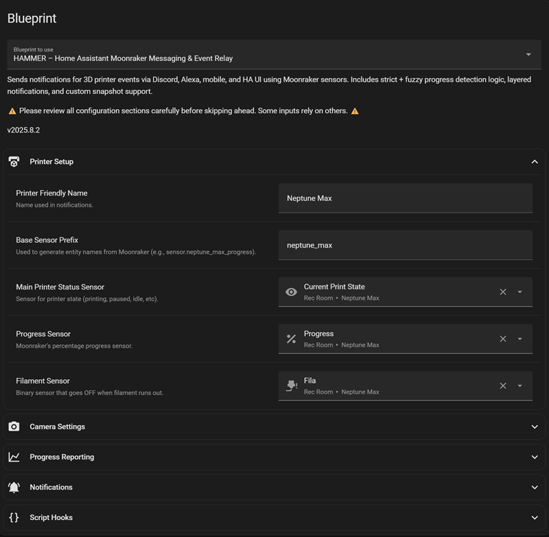

# 🔨 HAMMER – Home Assistant Moonraker Messaging & Event Relay

[](https://github.com/smcneece/HAMMER/releases)
[](https://github.com/smcneece/HAMMER/commits/main)
[](LICENSE)
[](https://github.com/smcneece)

> [](https://github.com/sponsors/smcneece) <-- Why not sponsor me, even a few bucks shows you appreciate the work and gives encouragement. You can sponsor me monthly, or just a one time thing. Check out my [other HA Automations & Blueprints](https://github.com/smcneece?tab=repositories) while you're here.

> ⭐ **Help Others Find This Blueprint!** If HAMMER is working well for you, please star this repository to help other Home Assistant users discover these 3D printer notifications!
>
> [](https://github.com/smcneece/HAMMER/stargazers) [](https://github.com/smcneece/HAMMER/network/members)

> 📬 **Stay Updated:** Click the "Watch" button (top-right of this repo) → "Releases only" to get email notifications when new versions are released!


This project was born out of a simple frustration: I missed being able to watch and share my 3D printer's progress with friends and family in our Discord hobby channel. OctoPrint handled this beautifully, but it doesn’t work with Klipper-based printers. So I built this—starting with Discord alerts, and then expanding into mobile, Alexa, persistent notifications, and more. What began as a fix for one missing feature became a full-featured alert system for any Klipper printer running Moonraker.

Get 3D printer alerts that actually matter! This Home Assistant automation keeps you in the loop with audio, visual, and customizable notifications—so you always know when your print is rolling, pausing, or wrapping up.

---

### ⚙️ Adjusting Moonraker Polling Rate

By default, the Moonraker integration polls your printer every 30 seconds for status updates. For more accurate notifications, you can adjust this setting:

1. Go to **Settings → Devices & Services → Integrations**
2. Find the **Moonraker** integration
3. Click the **gear icon** next to your printer device
4. Adjust the **Integration polling rate (s)** field (default: 30)
5. Click **Submit**

⚠️ **Important:** Too frequent polling may impact print quality or printer performance. Test carefully and monitor your printer's behavior after changes.

---

## 💥 Core Features

- 📢 **Discord Notifications**
- 🗣️ **Alexa Voice Alerts**
- 📱 **Mobile Notifications**
- 🖥️ **Persistent Home Assistant Notifications**
- 📷 **Snapshot & Thumbnail Support**
- 😹 **Toggle-Based Controls**
- ⏰ **Time-Restricted Alexa Announcements**
- 🎯 **Custom Progress Intervals**
- 🧵 **Filament Used (Per Job + Lifetime)**
- 🧹 **Collapsible UI**

---

## 📸 Example Discord Alerts

### Print Started (Discord)


### Print Finished (Discord)


---

## 🧠 TL;DR – Read This Before Filing Issues

- Fully modular — supports multiple printers with unique sensors
- Uses Moonraker integration sensors, not direct polling
- Short prints (<30 mins) may miss progress updates
- Uses fuzzy math to detect progress deltas
- Not a bug. Just how sensor polling works.

---

## 🛠️ Prerequisites

- **Home Assistant**
- **[Alexa Media Player](https://github.com/custom-components/alexa_media_player/wiki/Configuration)**
- **[Moonraker Integration](https://github.com/marcolivierarsenault/moonraker-home-assistant)**

**⚠️ Entity Naming Required – READ THIS ⚠️**

Before you do anything else, rename your printer's device in Home Assistant:

1. Go to **Settings → Devices & Services → Integrations**
2. Find the **Moonraker** integration
3. Each printer shows up as a device (usually called *1 Device* by default)
4. Click on the device name, then click the ✏️ **pencil icon** in the top-right
5. Enter a unique name (like `Neptune Max`, `Voron`, etc.)
6. Click **Update**
7. When prompted, allow Home Assistant to rename all related entities

This ensures all related sensors, cameras, and helpers follow a consistent naming pattern for the blueprint to recognize.

All Moonraker sensor and camera entities must follow a consistent naming pattern using a unique base name (example: `neptune_max`). This blueprint uses that base to dynamically build the required entity IDs like:

```
sensor.neptune_max_current_print_state
sensor.neptune_max_progress
camera.neptune_max_thumbnail
```

If your sensors are not named this way, rename them in Home Assistant to follow this format before using the blueprint. This is required even if you only have **one** printer.

---

### 🛠️ Discord Notification Setup (Optional)

Want notifications in Discord? You’ll need to set up a webhook and a shell command.
This is because Home Assistant’s built-in Discord integration doesn’t support sending images and text together — but a custom shell command using curl can.

#### Step 1: Create a Discord Webhook
1. Open Discord and go to **Server Settings → Integrations**.
2. Click **New Webhook**.
3. Choose a channel and click **Copy Webhook URL**.
4. **DO NOT share this URL with anyone.** It gives full access to post messages in your server.

#### Step 2: Add the Shell Command to Home Assistant

In your `shell_commands.yaml`:

```yaml
printer_notify_webhook: >
  curl -X POST -F "payload_json={\"content\": \"{{ message }}\"}" -F "file=@/config/www/{{ snapshot_filename }}" https://discord.com/api/webhooks/your_webhook_here
```

Replace the URL with your real webhook.
Do **not** quote the full URL.

Then add or make sure this exists in `configuration.yaml`:

```yaml
shell_command: !include shell_commands.yaml
```

---

### 🛠️ Installing HAMMER Blueprint

1. **Import the Blueprint:**  
   [](https://my.home-assistant.io/redirect/blueprint_import/?blueprint_url=https://raw.githubusercontent.com/smcneece/HAMMER/main/blueprints/automation/smcneece/hammer.yaml)

2. Fill out the required fields based on your printer's entity naming
3. Configure notification channels (Discord, Alexa, mobile, persistent)
4. Set your progress update interval and time restrictions
5. Test with a small print job

---

### 🔔 Staying Updated

HACS will not automatically notify you of new blueprint updates using this install method.

To get update notifications:
- Click the **“Watch”** button (top-right of the GitHub repo)
- Select **"Releases only"** or **"All Activity"**
- Or check the [Releases](https://github.com/smcneece/HAMMER/releases) page manually

---

### 🔍 Finding Your Mobile & Alexa Notify Entities

> ⚠️ Developer Tools → Services no longer shows notify services as of recent Home Assistant updates. Here's the new reliable method:

The `notify.` domain is funky and doesn’t always show up in the **Entities** list. Here’s the best way to find the right names:

#### 📱 Mobile App Notify Entity
1. Go to **Settings → Automations & Scenes → Create Automation**
2. Choose **Create New Automation**
3. Scroll to the **Then Do** section and click **Add Action**
4. Choose **Call Service**, then start typing `notify.mobile_app_`
5. You should see something like:
   ```
   notify.mobile_app_shawn_cell
   ```
6. That’s your mobile notification target.

#### 🗣️ Alexa Notify Entity

Make sure Alexa Media Player is installed and set up.

1. Go to **Settings → Automations & Scenes → Create Automation**
2. Create a new automation, scroll to **"Then Do"**, choose **Add Action**
3. Search for: `notify.alexa_media_`
4. Look for your Alexa device and click on it
5. Click the **3 dots** and pick **edit in yaml**
6. You'll see your device in the `action:` field

**Examples:**
- `notify.alexa_media_living_room_echo`
- `notify.alexa_media_3d_printer_notification_group`

**Tip:** Use the group name if you want multiple Echos to yell at you at once.

🧠 You can also create Alexa announcement groups in the Alexa app for easier control.

---

### 🧾 Example UI with Collapsible Sections

This is how the blueprint UI will look once loaded into Home Assistant.  
Sections are grouped using collapsible panels (requires Home Assistant 2024.4+).



## 📥 Blueprint Inputs Overview

**Main Inputs You Should Actually Care About**

- `sensor_base`: This is the base name for all your printer sensors. Example: `neptune_max` → builds `sensor.neptune_max_progress`, `camera.neptune_max_thumbnail`, etc.
- `main_sensor`: Your printer's print state sensor. Usually ends in `_current_print_state`
- `notify.mobile_app_*`: Your mobile phone's notify target
- `notify.alexa_media_*`: Alexa group or device for TTS alerts
- `disable_progress_notifications`: Turns off mobile + persistent alerts for print percentage spam
- `progress_interval`: Set this to how often you want updates (1%, 5%, 10%, etc.)
- `include_images_in_discord`: Toggles snapshot uploads to Discord
- `enable_alexa_notifications`: Toggle Alexa support entirely

If you don't touch anything else, you'll still be fine. But hey, more toys = more fun.

---

## 💡 Coming Soon / Ideas for v1.4+
- More completion stats
- Standard or Metric
- Klingon language pack
- Google Nest & Home Assistant voice support (if someone wants to donate them)
- Other notification systems (Pushbullet, etc.)
- Your idea here!
---


---

## 📜 Changelog

**v1.4.0**

- 🧵 Filament runout detection now sends alerts AND can run scripts  
- 🧰 Added optional script triggers for all major printer events (start, finish, error, filament-out)  
- 🗃️ Blueprint UI groups reorganized (collapsible input sections)

## 🏷️ GitHub Repo Tags
```
home-assistant, blueprint, 3d-printing, moonraker, klipper, discord, alexa, notifications, hacs
```
